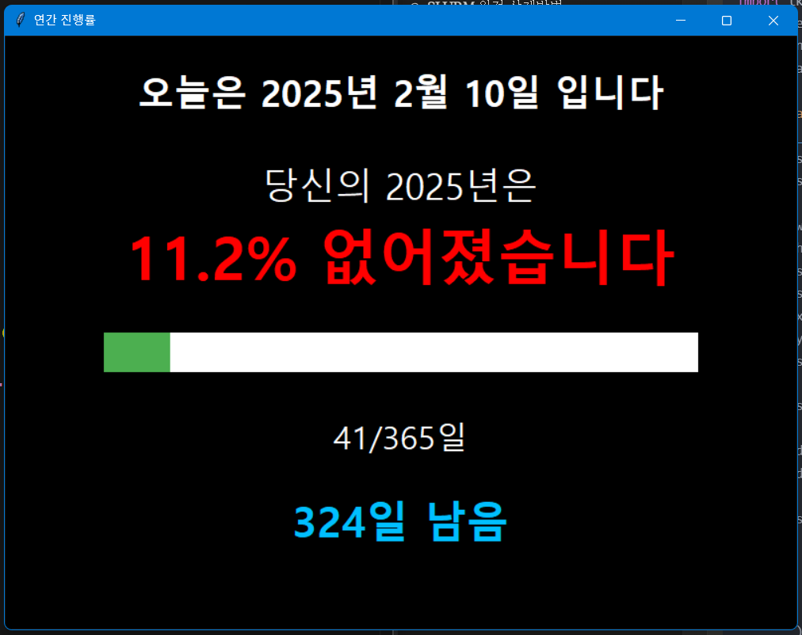

# D-Day & Year Progress: 당신의 시간을 더욱 효율적으로 낭비하세요! 😈



이 프로그램은 당신이 하루하루 의미 없이 흘려보내고 있는 **한심한 연간 진행 현황**을 대놓고 숫자와 퍼센트라는 팩트로 후려쳐서 보여주는 동시에, 그나마 남은 시간이라도 제대로 관리하라고(사실은 쳐내라고) 제일 존나 급한 일정까지 알려주는 **친절한(?) 프로그램**입니다.

`Python`과 `flet`만 깔려 있으면 누구나 돌려볼 수 있으니, 마음의 준비를 단단히 하시고 실행해 보세요.

---

## 주요 기능

1. **올해 진행률 보기** (원조 기능)
   - 날짜 감각을 잃어버리지 않도록, "오늘이 몇 월 며칠"인지 다시 알려줍니다.
   - 지금까지 당신이 똥이나 싸면서 헛살아온 시간이 올해 전체의 몇 퍼센트인지 숫자와 진행 바(Progress Bar)로 보여줍니다.
   - 경각심을 불러일으키기 위해 일부 글자를 **혁명의 붉은 색**으로 표현했습니다. 레볼루숑!
   - 당신이 "내게.. 망가질 시간.. 이라는 것이 충분히 남았나..?" 라는 철학적 질문을 스스로 던지도록 하는 강력한 키워드가 될 것입니다.

2. **일정 관리** (새로운 기능)
   - 남은 시간이라도 제대로 관리하라고 일정을 추가/수정/삭제할 수 있습니다.
   - D-Day 카운트다운으로 당신의 나태함을 실시간으로 보여줍니다.
   - 메모 기능으로 당신의 변명거리도 기록할 수 있습니다.
   - 캘린더로 날짜를 쉽게 선택할 수 있습니다 (이제 날짜를 잘못 입력할 변명도 없습니다).

---

## 의존성(Dependencies)

- **Python 3.6 이상**
  - 근데 솔직히 파이썬 버전에 큰 의미는 없습니다만
  - f-string 문법(`f"{variable}"`)을 사용하므로 3.6 미만에서는 동작하지 않을 수 있습니다.

- **flet**
  - GUI 실행에 필요한 라이브러리입니다. 다음 명령어로 설치할 수 있습니다:

  ```bash
  pip install flet
  ```

  - 뭔소린지 모르시면, 씁. 일단 알겠습니다.

- **calendar, datetime**  
  - 파이썬 표준 라이브러리에 포함되어 있으므로 별도 설치는 필요 없습니다.

- **'Malgun Gothic' 폰트**  
  - Windows에서는 기본적으로 설치되어 있지만, 다른 OS에서는 글꼴 설정을 변경하거나 해당 폰트를 추가로 설치해야 합니다.
  - 다른 폰트를 지정할 생각은 아직은 없습니다. 귀찮기 때문에ㅋ.

---

## 실행 방법

### 1. 소스 코드로 실행

1. 이 저장소를 클론하거나 ZIP 파일로 다운로드하여 압축을 풉니다.
2. 터미널(명령 프롬프트)에서 프로젝트 폴더로 이동합니다.
3. 다음 명령어로 스크립트를 실행합니다.

```bash
python flet_dday_app.py
```

   (운영체제/환경에 따라 다를 수 있음)

4. flet을 설치한 경우, 다음 명령어로 스크립트를 실행할 수도 있습니다.

```bash
flet run flet_dday_app.py
```

### 2. 실행 파일로 실행 (직접 빌드 필요)

> **참고**: 현재는 실행 파일이 제공되지 않습니다. 실행 파일을 사용하고 싶다면 [빌드 가이드](BUILD.md)를 참고하여 직접 빌드해주세요.

- **Windows**: 빌드 후 `D-Day_Year_Progress.exe` 파일을 더블클릭하면 됩니다. Python이나 flet 설치 필요 없음!
- **MacOS**: 빌드 후 `D-Day_Year_Progress.app`을 더블클릭하면 됩니다. 역시 Python이나 flet 설치 필요 없음!

## 주의사항

- 폰트가 없으면 글자가 깨질 수도 있는데, 폰트 설치는 알아서..
- CLI 전용 서버에서는 GUI가 동작하지 않을 수 있습니다.
- **정신적 피해**:
  - 올해가 이미 이렇게 지나가 버렸다는 사실에 현타가 올 수 있습니다.
  - 일정 관리 기능으로 인해 당신의 나태함이 더욱 명확해질 수 있습니다.
  - 책임은 본인에게 있습니다.

---

## 라이선스

Copyright 2025 AidALL Inc. All rights reserved.
